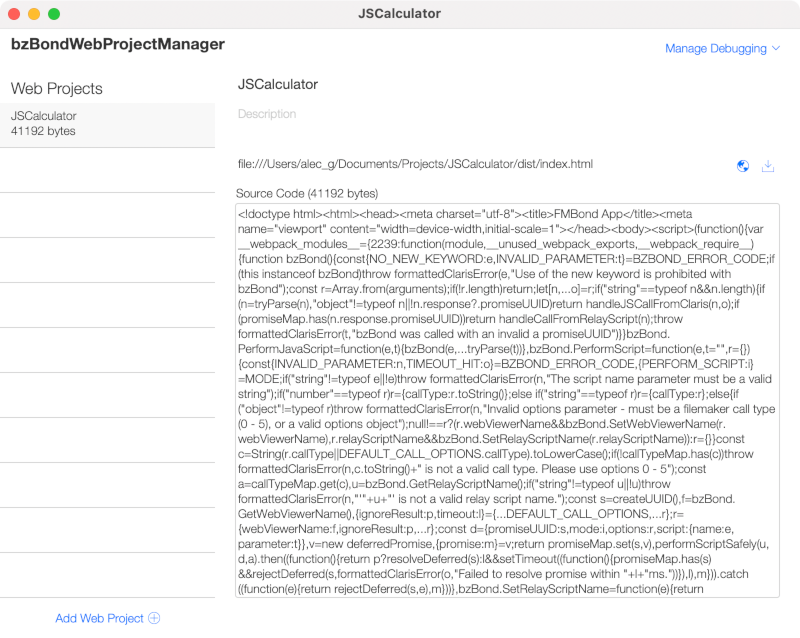
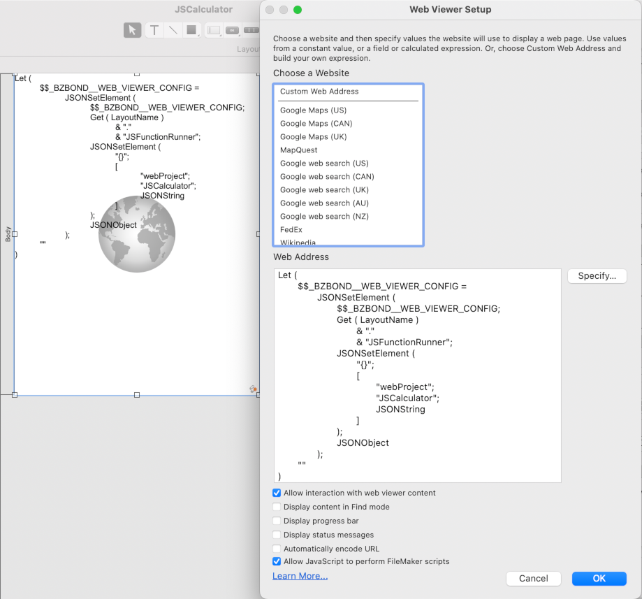
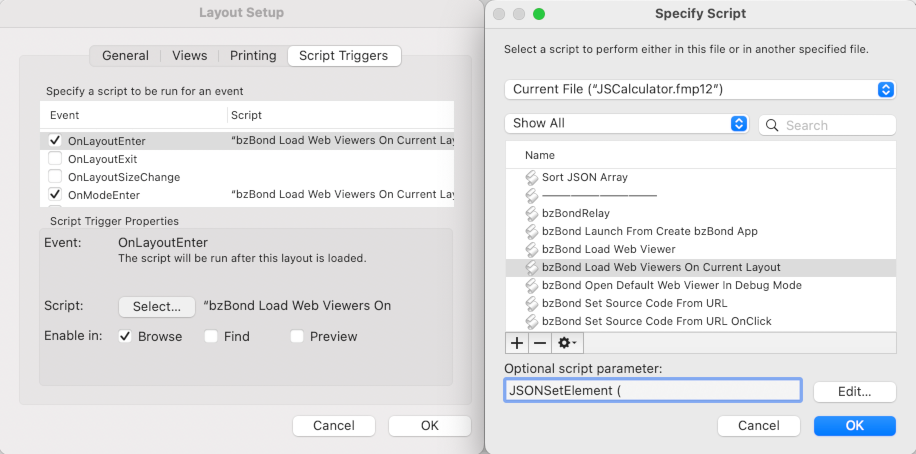
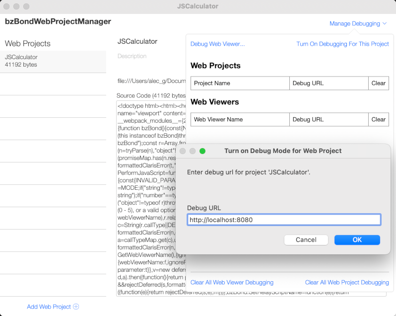

<p align="center"></p>

<h2 align="center">Quality tools for Claris Web Integrations</h2>

😎 Reliably run web UIs and JavaScript libraries in web viewers

⏩ Speed up FileMaker scripts with JavaScript functions

💾 Store and deploy web code

🎉 Keep the JavaScript party going server-side with an extensible microservice

## Table of contents

- Quick start
- Usage
- The Tools
  - bzBond-js
  - bzBond-claris
  - create-bzbond-app
  - bzBond-web-template
  - bzBond-server

## Quick start

### Claris-focused quick start

#### Requirements

- [FileMaker or Claris Pro](https://www.claris.com/)

#### Instructions

1. Download [bzBond-claris.fmp12](packages/bzBond-claris/bzBond-claris.fmp12)
2. Open bzBond-claris.fmp12 and explore

### Web-focused quick start

#### Requirements

- [FileMaker or Claris Pro](https://www.claris.com/)
- [node/npm](https://nodejs.org/en/download/)
- [git](https://git-scm.com/downloads)

#### Instructions

1. On the command line run `npx -y @beezwax/create-bzbond-app <project-name>`.<br>
E.g. `npx -y @beezwax/create-bzbond-app testing-bzbond`<br>
An all in one FileMaker/Web Project file with the same name as your project should open

## Usage

FileMaker/Claris Pro can harness the power of web technologies to enhance user and developer experience. bzBond provides tools to make it easier to do this. Here's some of the things you can do.

### Control web viewer scripting with promises

bzBond treats script calls from web viewers as promises, letting you chain them or use async/await.

In the code below we want to add the current user to a group. First we need to get their account name, then we want to add them to the group. To synchronize these operations we chain two scripts together, using the result of the first script in the parameter of the second script. The UI is updated at each point in the process. 
```
// Get the UI html element to update
status = document.getElement("#status");
// Update the UI to show process is about to run 
status.textContent = "Adding user to group...";

// Run FileMaker scripts to add the current user to a group
// First FileMaker script gets the user's account name
bzBond.PerformScript("Get Account Name")
  .then(accountName => {

    // Update the UI with the result of the first FileMaker script
    status.textContent = `Account Name is ${accountName}`;

    // Second FileMaker script adds the user to the group "bzBuzz"
    bzBond.PerformScript("Add User To Group", {accountName, group: "bzBuzz"})
  })
  .then(groupSize => {

    // Update the UI with the result of the second FileMaker script
    status.textContent = `Group size is ${groupSize}`;
  });
```

### Add a JavaScript function runner to your scripts

In the script below we are sorting a JSON array, something that is complex to code and slow to run when done natively. With bzBond we are using just a few lines of JavaScript and the script takes only 250ms to run. Sorted!


#### Works on server!

With bzBond-server installed on FileMaker/Claris Server the script will work on the server without any changes.

### Easily compile to a single file

Every web project created with [create-bzbond-app](packages/create-bzbond-app/README.md) can be compiled to a single file web project by simply running the build script: `npm run build`

### Lighten the load of loading code

Store your single file web projects in the simple bzBond web project manager:



To deploy in a web viewer, reference the project name in the web viewer calculation dialog:



And call a configurable script to precisely control the load process:



#### Fully integrated debugging/dev server

When it comes to real-time code updates, FileMaker is the OG. The bzBond web project manager stays true to its roots and lets you see web code updates in real-time. Simply switch on debugging at the web project or web viewer level:



## The Tools

### bzBond-js

bzBond-js is a javascript library that manages interactions between FileMaker/Claris Pro scripts and web viewer layout objects. It can be installed in an npm project using the command `npm install @beezwax/bzbond-js`. To communicate with FileMaker, bzBond-js calls the script bzBondRelay, which is in the [bzBond-claris.fmp12](#bzbond-claris) file.

[Learn more about bzBond-js](packages/bzBond-js/README.md)

### bzBond-claris

bzBond-claris is a FileMaker Pro file containing tools to manage interactions with bzbond-js and store and deploy bzbond web project code. It also includes educational material and examples to help you get started with bzBond.

[Learn more about bzBond-claris](packages/bzBond-claris/README.md)

### create-bzbond-app

create-bzbond-app is the best way to create new bzBond projects. It requires [node/npm](https://nodejs.org/en/download/) and [git](https://git-scm.com/downloads).

[Learn more about create-bzBond-app](packages/bzBond-claris/README.md)

### bzBond-web-template

bzBond-web-template forms the core of [create-bzbond-app](#create-bzbond-app). It includes [bzBond-js](#bzbond-js) and a build config that creates a single html file that can be used as the source for a bzBond web project.

[Learn more about bzBond-server](packages/bzBond-server/README.md)

### bzBond-server

bzBond-server is a server-based microservice that works with the `bzBondRelay` script to allow JavaScript to be run on FileMaker/Claris Server.

[Learn more about bzBond-server](packages/bzBond-server/README.md)