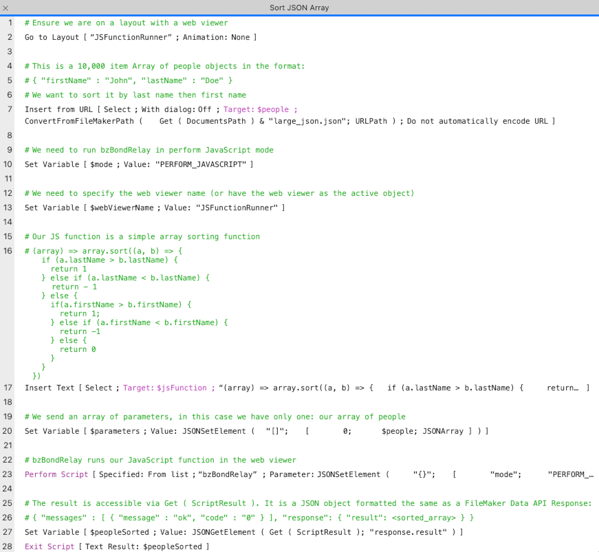

<p align="center"></p>

<h2 align="center">Quality tools for Claris Web Integrations</h1>

😎 Reliably run web UIs and JavaScript libraries in web viewers

⏩ Speed up FileMaker scripts with JavaScript functions

💾 Store and deploy web code

🎉 Keep the JavaScript party going server-side with an extensible microservice

## Table of contents

- Quick start
- The tools
  - bzBond-js
  - bzBond-claris

## Quick start

### Claris-focused quick start

#### Requirements

- [FileMaker or Claris Pro](https://www.claris.com/)

#### Instructions

1. Download [bzBond-claris.fmp12](packages/bzBond-claris/bzBond-claris.fmp12)
2. Open bzBond-claris.fmp12 and explore

### Web-focused quick start

#### Requirements

- [FileMaker or Claris Pro](https://www.claris.com/)
- [node/npm](https://nodejs.org/en/download/)
- [git](https://git-scm.com/downloads)

#### Instructions

1. On the command line run `npx -y @beezwax/create-bzbond-app <project-name>`.<br>
E.g. `npx -y @beezwax/create-bzbond-app testing-bzbond`<br>
An all in one FileMaker/Web Project file with the same name as your project should open

## Usage

FileMaker/Claris Pro can harness the power of web technologies to enhance user and developer experience. bzBond provides tools to make it easier to leverage web technologies. Here's some of the things you can do.

### Control web viewer scripting with promises

bzBond treats script calls from web viewers as promises, letting you chain them or use async/await.
```
bzBond.PerformScript("Get User")
  .then(userId => {
    status.textContent = `User ID is ${userId}`;
    const group = "bzBuzz"
    bzBond.PerformScript("Add User To Group", {userId, group})
  })
  .then(groupSize => {
    status.textContent = `There ${groupSize > 1 ? `are ${groupSize} people` : "is 1 person" } in the group`;
  });
```

### Add a JavaScript function runner to your scripts

In the script below we are sorting a JSON array, something that is extremely complex to code and slow to run when done natively. With bzBond we are using just a few lines of JavaScript and the script takes just 250ms to run. Sorted!



#### Works on server!
With bzBond-server installed on FileMaker/Claris Server the same pattern will work on the Server without any script changes 


## The tools

### bzBond-js

bzBond-js is a javascript library that manages interactions between FileMaker/Claris Pro scripts and web viewer layout objects. It can be installed using the command `npm install @beezwax/bzbond-js`. bzBond-js calls the script bzBondRelay, which is in the [bzBond-claris.fmp12](#bzbond-claris) file.

[Learn more about bzBond-js](packages/bzBond-js/README.md)

### bzBond-claris

bzBond-claris is a FileMaker Pro file containing tools to manage interactions with bzbond-js and store and deploy bzbond web project code. It also includes educational material and examples to help you get started with bzBond.

[Learn more about bzBond-claris](packages/bzBond-claris/README.md)

### create-bzbond-app

create-bzbond-app is the best way to create new bzBond projects. It requires [node/npm](https://nodejs.org/en/download/) and [git](https://git-scm.com/downloads).

[Learn more about create-bzBond-app](packages/bzBond-claris/README.md)

#### Create an all-in-one project with create-bzbond-app

```
npx -y @beezwax/create-bzbond-app <app-name>
// e.g
npx -y @beezwax/create-bzbond-app my-aio-app
```

#### Create a web-only project with create-bzbond-app

```
npx -y @beezwax/create-bzbond-app <app-name> --web-only
// e.g
npx -y @beezwax/create-bzbond-app my-web-only-app --web-only
```

#### Create a web-only project with create-bzbond-app

```
npx -y @beezwax/create-bzbond-app <app-name> --claris-only
// e.g
npx -y @beezwax/create-bzbond-app my-claris-only-app --claris-only
```

### bzBond-web-template

bzBond-web-template forms the core of [create-bzbond-app](#create-bzbond-app). It includes [bzBond-js](#bzbond-js) and a build config that creates a single html file that can be used as the source for a bzBond web project.

[Learn more about bzBond-server](packages/bzBond-server/README.md)

### bzBond-server

bzBond-server is a server-based microservice that works with the `bzBondRelay` script to allow JavaScript to be run on FileMaker/Claris Server.

[Learn more about bzBond-server](packages/bzBond-server/README.md)