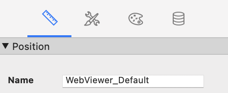
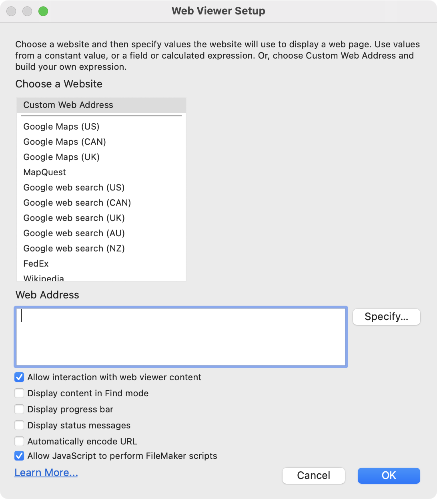

# bzBond-js

## Table of Contents

- [Introduction](#introduction)
- [Features](#features)
- [Installation](#installation)
- [Requirements](#requirements)
- [Usage](#usage)
  - [Performing Claris/FileMaker Scripts from JavaScript](#performing-clarisfilemaker-scripts-from-javascript)
    - [PerformScript](#bzbondperformscriptscriptname-scriptparameter-options)
    - [{Set/Get}WebViewerName](#bzbondsetwebviewernamewebviewername--bzbondgetwebviewername)
    - [SetWebViewerNameFromClaris](#bzbondsetwebviewernamefromclaris)
    - [{Set/Get}RelayScriptName](#bzbondsetrelayscriptnamerelayscriptname--bzbondgetrelayscriptname)
    - [SyncConfig](#bzbondsyncconfig)
    - [RegisterScript](#bzbondregisterscriptpluginoptions)
  - [Promise rejection and Error Handling](#promise-rejection-and-error-handling)
  - [Integrating JavaScript functions with Claris/FileMaker scripts](#integrating-javascript-functions-with-clarisfilemaker-scripts)
- [Contributors](#contributors)

## Introduction

bzBond-js is part of the [bzBond](/) toolset. It manages interactions between FileMaker scripts and FileMaker Web Viewers. It requires [bzBond-claris](../bzBond-claris/).

## Features

- Call Claris/FileMaker scripts from web viewers using `bzBond.PerformScript`. This function returns a **JavaScript Promise** including the script result.
- Use JavaScript functions in Claris/FileMaker scripts by calling the `bzBondRelay` script. Function results can be accessed in `Get ( ScriptResult )`
- Extensible through a built-in plugin registration system.

## Installation

1. Install bzBond-js
```
npm i @beezwax/bzbond-js
```

2. Download the [bzBond-claris.fmp12](https://github.com/beezwax/bzbond/blob/main/packages/bzBond-claris/bzBond-claris.fmp12?raw=true) Claris/FileMaker file, and copy the `bzBondRelay` script into the target Claris/FileMaker file.

## Requirements

- FileMaker >=19.3.
- Web Viewers that host the bzBond code must:
  - Have an **object name** assigned in Layout inspector:
  

  - Have the **'Allow JavaScript to perform FileMaker scripts'** option on in the Web Viewer Setup dialog checked:
  

---

## Usage

### Performing Claris/FileMaker Scripts from JavaScript

#### bzBond.PerformScript(scriptName, [scriptParameter, options])

```
bzBond.PerformScript("add two numbers", { firstNum: 1, secondNum: 2 })
    .then((result) => console.log(result));

bzBond.PerformScript("Get User Data", "user-123", { timeout: 3000 })
    .then((data) => console.log(data.firstName))
    .catch((e) => console.log('request took too long', e));
```

The (optional) **options** parameter can contain any of the following (defaults shown):
```
{
    webViewerName: "",         // The name of the web viewer hosting the web code.
    timeout: null,             // Number of milliseconds to wait before a promise is rejected.
    callType: 0                // The Claris/FileMaker 'call type'.
    relayScript: "bzBondRelay" // The relay script as it is named in the Claris/FileMaker solution.
    ignoreResult: false        // When true, promise resolves immediately - does not wait for Claris/FileMaker script.
}
```

The **callType** can be any of the following values (when not provided it is "continue" by default). See the [Claris documentation](https://help.claris.com/en/pro-help/content/options-for-starting-scripts.html) for more details.
```
"continue"  (or 0, "0")
"halt"      (or 1, "1")
"exit"      (or 2, "2")
"resume"    (or 3, "3")
"pause"     (or 4, "4")
"interrupt" (or 5, "5")
```

The **callType** can alternatively be provided as part of an object, or string.
```
    bzBond.PerformScript("Get Data", "", { callType: "interrupt" });
    // is equal to
    bzBond.PerformScript("Get Data", "", "interrupt" );
```

#### bzBond.SetWebViewerName(webViewerName) | bzBond.GetWebViewerName()

This method manually associates bzBond with the name of the Web Viewer the code resides in.
- This step is optional when using the provided bzBondRelay script (it automatically determines the name of the web viewer).
- If you choose to write a custom relay script using the spec, you may need to set the name in your JS code.

```
    bzBond.GetWebViewerName(); // "" (default)
    bzBond.SetWebViewerName("myWebViewer");
    bzBond.GetWebViewerName(); // "myWebViewer"
```

#### bzBond.SetWebViewerNameFromClaris()

Determines the name of the web viewer that bzBond is running in and stores it as part of the bzBond instance. This is useful for ensuring that subsequent `bzBond.PerformScript` calls do not invoke potentially expensive searches for the initiating web viewer.

Returns a **promise**

```
bzBond.GetWebViewerName(); // ""
bzBond.SetWebViewerNameFromClaris()
    .then((result) => {
        console.log(result) // "myWV"
        console.log(bzBond.GetWebViewerName()) // "myWV"
    });
```


#### bzBond.SetRelayScriptName(relayScriptName) | bzBond.GetRelayScriptName()

If you choose to change the name of the Relay Script in Claris/FileMaker Pro, use this step to ensure bzBond calls to Claris/FileMaker Pro perform the correct script.

```
bzBond.GetRelayScriptName(); // "bzBondRelay" (default)
bzBond.SetRelayScriptName("My Relay Script");
bzBond.GetRelayScriptName(); // "My Relay Script"
```

#### bzBond.SyncConfig()

To learn more about web viewer config see [bzBond-claris](../bzBond-claris/README.md#web-viewer-config)

- `SyncConfig` returns the Web Viewer JSON config as a **promise** result.
- `SetWebViewerConfigFromClaris` gets the current web viewer config state from Claris/FileMaker Pro and updates the config stored in bzBond-js.
- `SetWebViewerConfig(webViewerConfig)` allows manual overwrite of the configuration stored in bzBond-js.
- `GetConfig` returns the current configuration stored in bzBond-js.

#### bzBond.RegisterScript(pluginOptions)

It possible to extend bzBond-js by registering custom Claris/FileMaker scripts, which can then be can be called as methods.

1. Create a script in Claris/FileMaker Pro.
2. Perform `bzBond.RegisterScript` giving it the appropriate **pluginOptions**:
  - `exec`: the method that becomes available to use on the `bzBond` class.
  - `scriptName`: the Claris/FileMaker script that will be run when the method defined in `exec` is called.
  - `throwIf`: (optional) callback function that takes the result of the script defined in `scriptName` as a parameter. If the function returns `true` an error will be thrown.

```
// In this example, we create a Claris/FileMaker script called 'Execute Data Api', and associate that with the method 'executeDataApi'
bzBond.RegisterScript({
    exec: "executeDataApi",
    scriptName: "Execute Data Api",
    throwIf: (scriptResult) => {
        return scriptResult.messages[0].code !== "0" ;
    },
});


// Performing the script
const myQuery = {
    layouts: "FAKE_DATA",
    query: [{
        SOME_DATA: "==definitely data here",
    }],
};
bzBond.executeDataApi(myQuery)
    .then((result) => {
        console.log('my data', result);
    })
    .catch((e) => {
        console.log('query failed', e.toString());
    });


// The second parameter can also take advantage of bzBond options
bzBond.executeDataApi(myQuery, { timeout: 3000, callType: "interrupt" })
    .then((result) => {
        console.log('my data', result);
    })
    .catch((e) => {
        console.log('query failed', e.toString());
    });
```

### Promise rejection and Error Handling

The promises settled by the bzBond relay script will only reject when the specified Claris/FileMaker script is missing.

Otherwise, the result of the script's `Exit Script[]` step will be returned as the result of **resolved promise** and **not** a rejected promise. Because there is no standard way to indicate that a Claris/FileMaker script resulted in an error, the result of the promise will need to be inspected and an error thrown if required.

Note that when registering a plugin, the `throwIf` parameter can be used set the result state(s) that should throw errors.

### Integrating JavaScript functions with Claris/FileMaker scripts

bzBond-js works with bzBond-claris to allow Javascript functions defined in FileMaker scripts to run and return results in the regular FileMaker script flow. See the [bzBond-claris](../bzBond-claris/README.md#integrating-javascript-functions-with-filemaker-scripts) documentation for more details.

**Errors** are captured and returned for the following scenarios:

- function does not exist in JavaScript.
- function defined as a string in Claris/FileMaker has invalid syntax (eg: `"(a, b,,, => a + b"`).
- function executed in JavaScript throws an error.
- bzBond does not exist in the web viewer (in this case, the PerformJavascript step itself will surface an error - this situation must be manually handled).

```
{
	"messages" :
	[
		{
			"code" : "5",
			"message" : "The function 'MyGlobalFunc' is missing from the global scope, or is not a valid function definition"
		}
	],
	"response" : {}
}
```

## Contributors

Created by [Beezwax](https://www.beezwax.net/)
